# CSE

## 프로젝트 개요
- **주제**: 활동 감지 스마트 홈
- **팀명**: CSE
- **지도 교수**: 조용호 교수님
- **팀원**: 김예찬, 원준혁, 장성민, 최진호

## 목차
1. 팀원별 역할
2. 개발 일정
3. 목적 계통도
4. 기능 블록도 및 작품 요약
5. 설계 제한 요소
6. 소프트웨어 및 하드웨어
7. 알고리즘 설명 및 상세 설명
8. 제작 과정
9. 소스 코드
10. 결과
11. 회의록
12. 참고자료

---

### 1. 팀원별 역할

- **김예찬**: 음성 인식 작업, 라즈베리파이 서버 관리
- **원준혁**: 프로젝트 총괄, 인터페이스 구현
- **장성민**: 자료 조사, 객체 인식 프로그램 작성
- **최진호**: 자료 조사 보조, 이메일 자동 전송 코드 작성
  
---
### 2. 개발 일정

개발 일정은 프로젝트 진행에 따라 다르게 진행되었습니다. (상세 내용 생략)
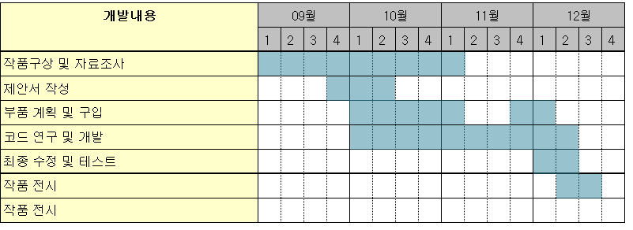

---
### 3. 목적 계통도

목적 계통도를 통해 프로젝트의 주요 기능과 흐름을 정의했습니다.
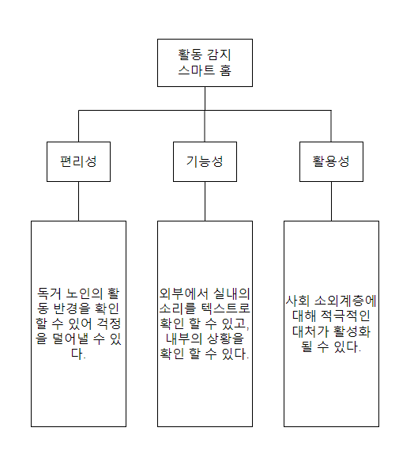

---
### 4. 기능 블록도 및 작품 요약

- 라즈베리파이 카메라를 통해 사람 인식
- 30초 이상 움직임이 없을 경우 이메일 알림 전송
- 음성 인식을 통해 특정 명령 실행
- 어플리케이션과 라즈베리파이의 실시간 데이터 통신  
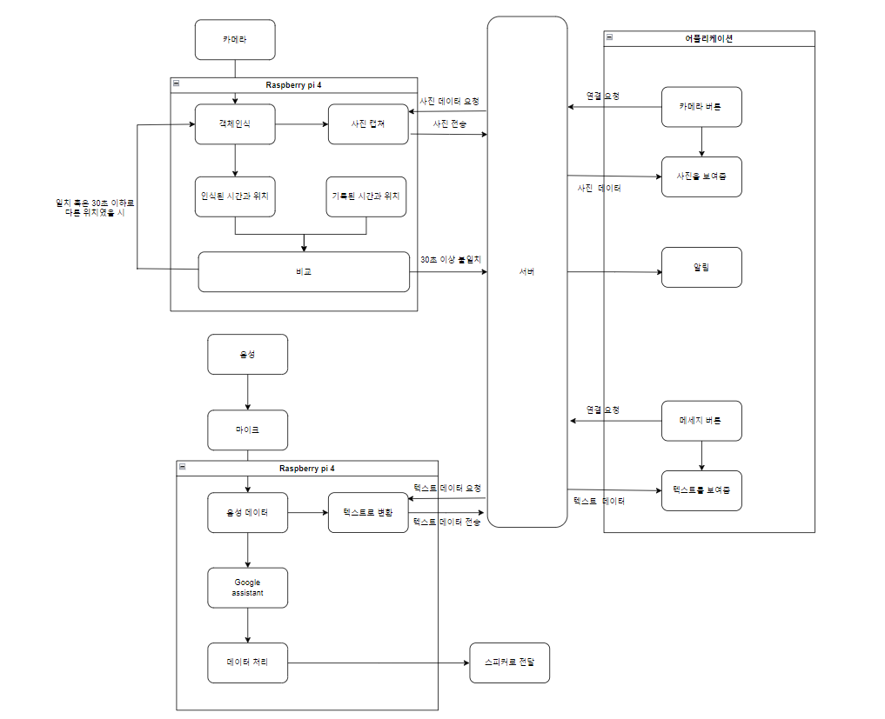

---
### 5. 설계 제한 요소
- **안전성**: 구조물의 안전성 확보
- **신뢰성**: 어플리케이션과 통신의 안정성 보장
- **사회적 영향**: 독거노인을 위한 사회적 대처

---
### 6. 사용된 소프트웨어 및 하드웨어
- **소프트웨어**:
  - YOLO V8nano: 객체 인식
  - OpenCV: 객체 인식 보조
  - Android Studio: 어플리케이션 개발
  - Google Assistant: 음성 인식
- **하드웨어**:
  - RaspberryPi, 스피커, 카메라, 마이크

---
### 7. 알고리즘 설명 및 상세 설명

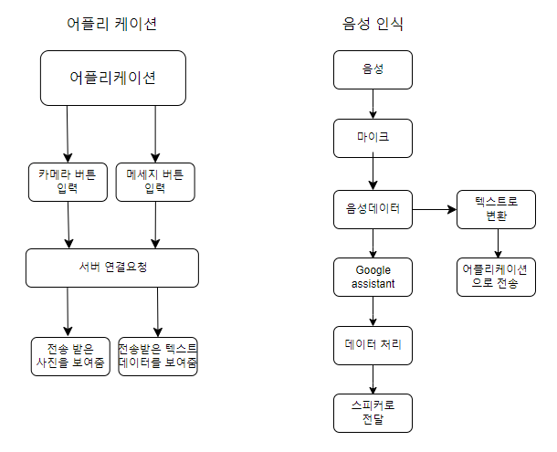
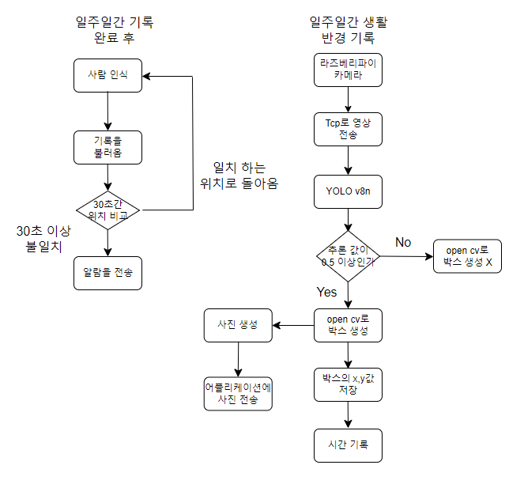
- YOLO를 통한 객체 인식 후 위치 정보를 분석하여 30초 이상 비정상적 움직임이 없을 경우 알림을 전송
- 마이크를 통해 음성 데이터를 실시간으로 받아 Google Assistant를 통해 처리
- 특정 음성 인식 시 경고 메시지를 이메일로 전송

---
### 8. 제작 과정
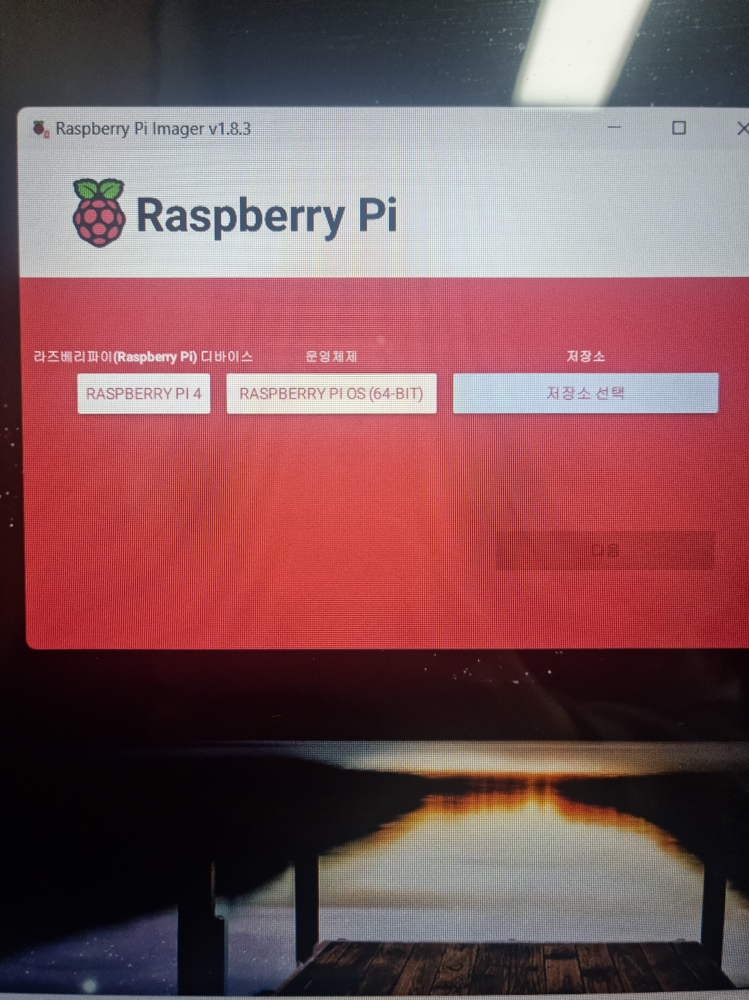

1. Raspberry Pi에 64비트 OS 설치
   
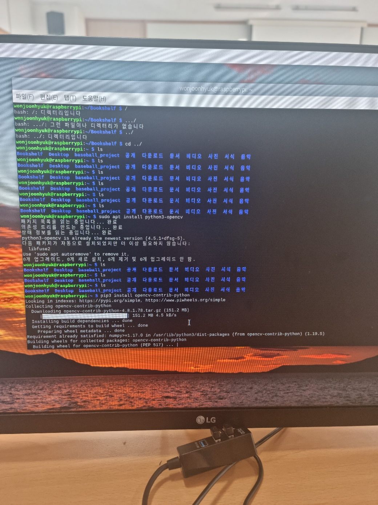
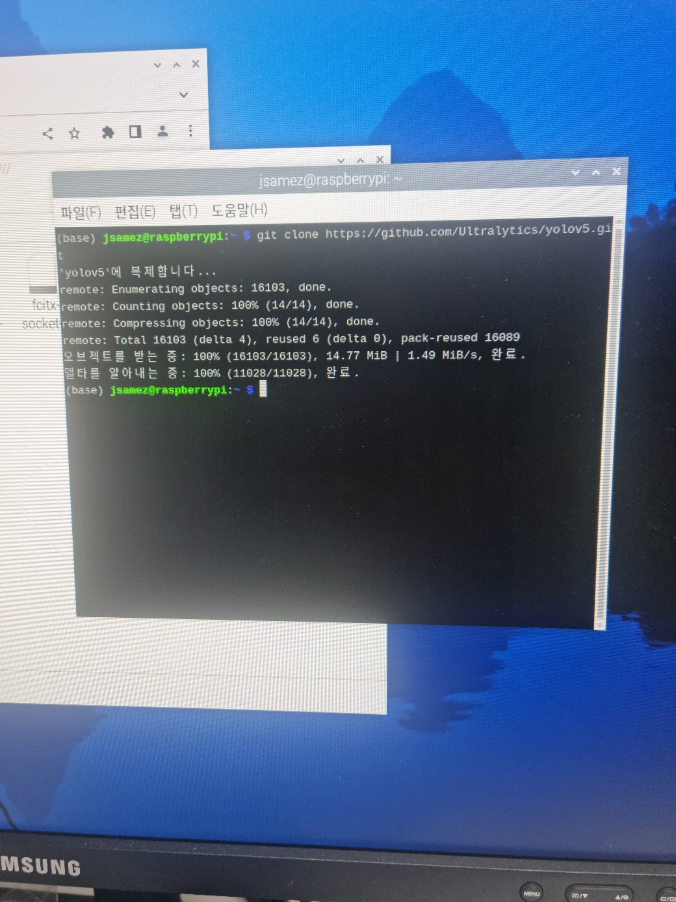
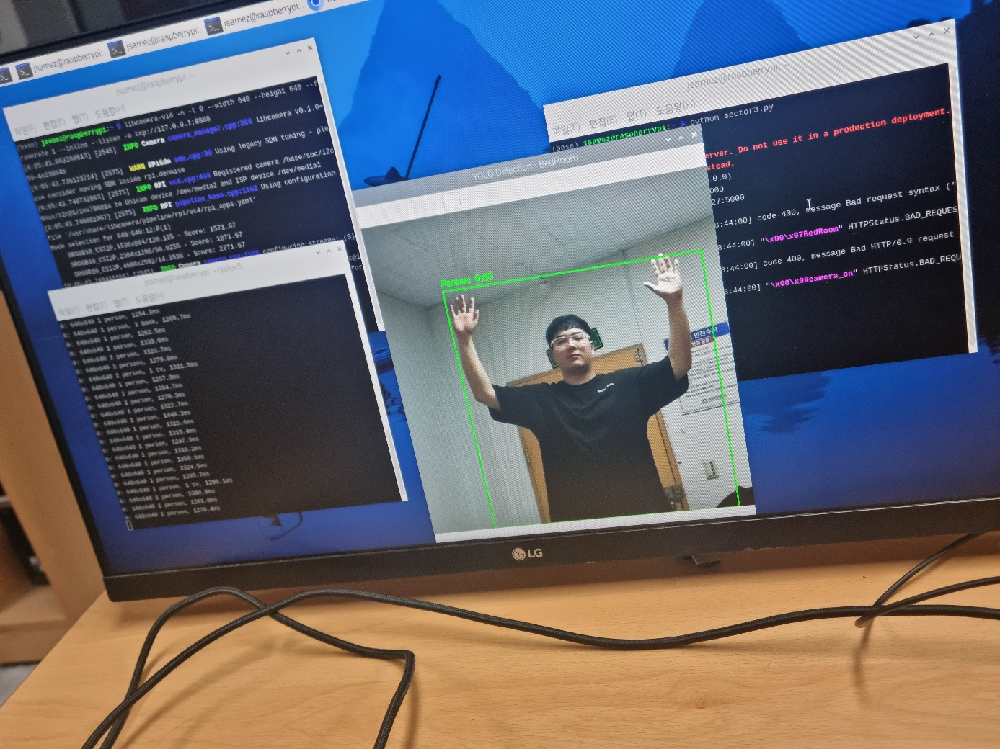

2. OpenCV 설치 및 YOLO 모델 사용

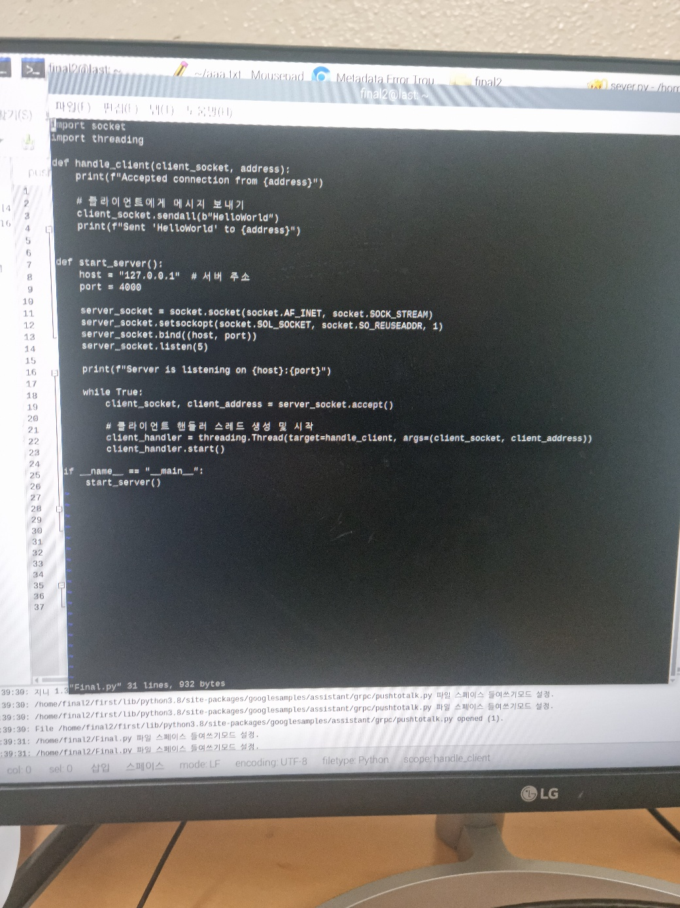  
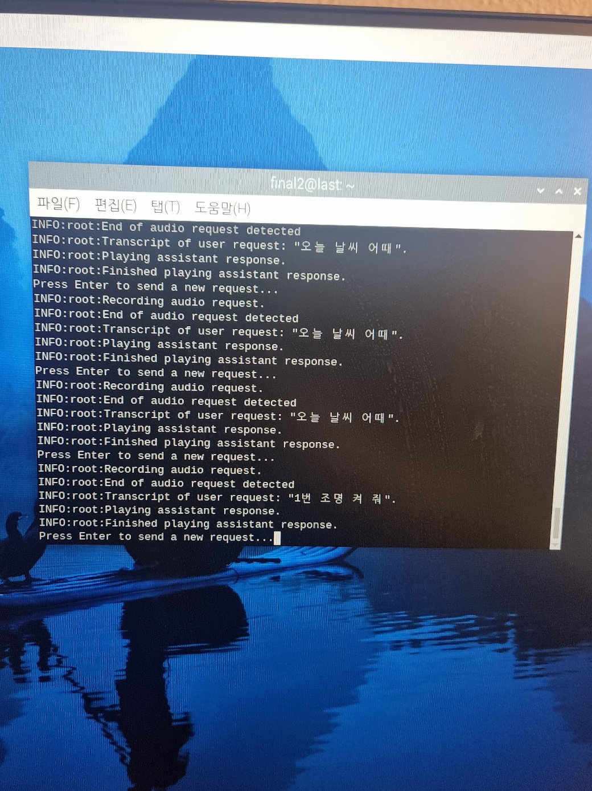

3. TCP/IP를 이용한 서버 구축 및 소켓 통신 구현

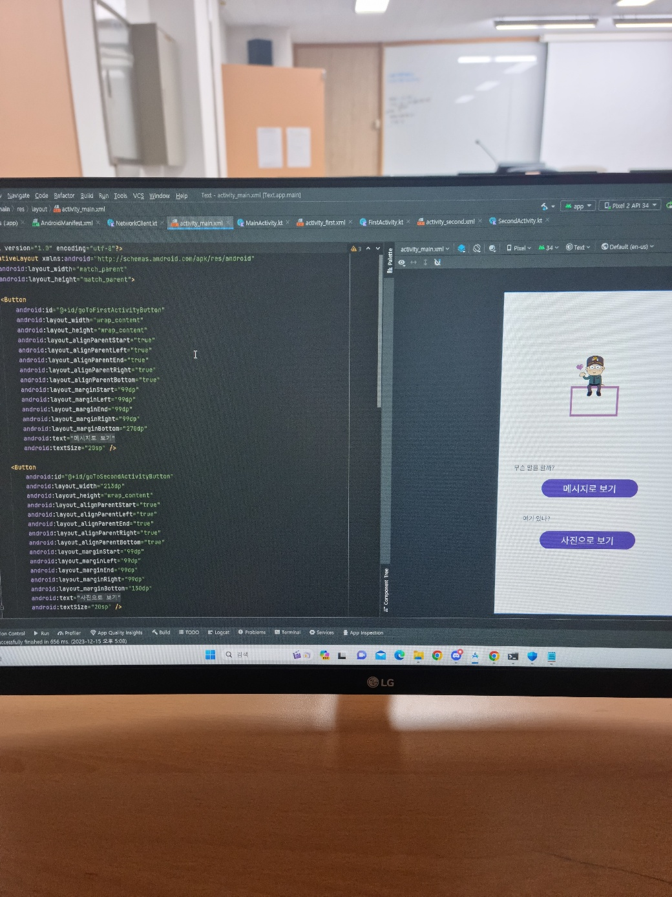
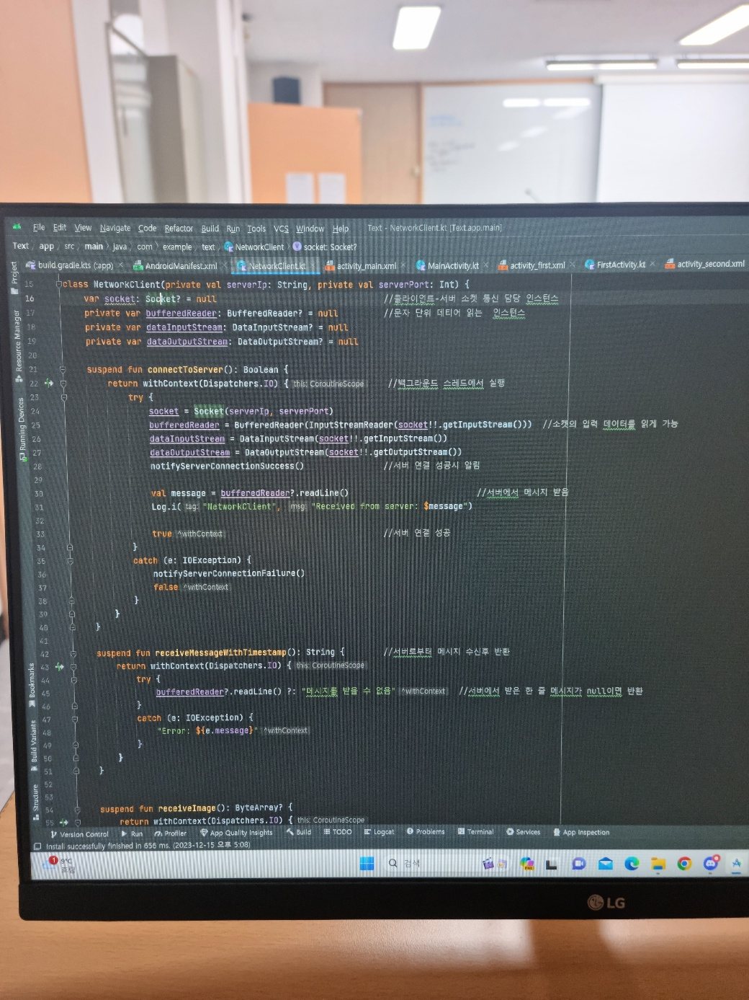
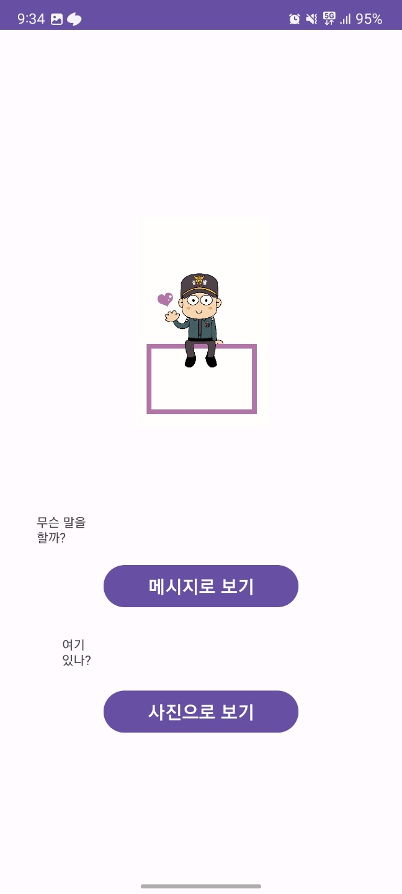

4. Android Studio를 이용해 클라이언트 어플리케이션 개발

---
### 9. 현재까지 개발된 소스 코드
- **YOLO 객체 인식 코드**: 라즈베리파이에서 YOLO 모델을 사용하여 사람을 인식하고 비정상적 움직임 시 알림 전송
- **TCP/IP 서버 코드**: 클라이언트와 실시간 통신을 위한 서버 구현
- **자동 이메일 전송 코드**: 위험 상황 발생 시 이메일로 경고 전송
- **Android 클라이언트 코드**: 어플리케이션에서 서버와 통신하여 실시간 데이터 수신

---
### 10. 결과

---
### 11. 회의록
- **9월 14일**: 라즈베리파이를 사용하여 작품을 만들기로 결정
- **9월 15일**: 스마트창문 제작 결정
- **9월 21일**: 스마트창문 아이디어 폐기, 박수 소리를 이용한 홈 제어 시스템으로 전환
- **9월 26일**: 박수 소리 인식 방법에 대한 의견 공유
- **10월 10일**: 필요 물품 조사 및 구매
- **10월 25일**: 어플리케이션과 라즈베리파이 통신 방법 논의
- **11월 15일**: 박수 소리 아이디어 폐기, 독거노인 위급 상황 대응 시스템 제작 결정
- **11월 27일**: 어플리케이션과 라즈베리파이 통신 방법 모색 (HTTP 및 TCP/IP 프로토콜 사용 결정)
- **12월 5일**: 필요 물품 조사 및 구매
- **12월 10일**: 어플리케이션과 라즈베리파이 통신 실패로 인해 방법 모색 및 구현 시도

---
### 참고자료
- [실시간 추론 - PYTORCH](https://tutorials.pytorch.kr/intermediate/realtime_rpi.html)
- [라즈베리파이 YOLO 사용](https://docs.ultralytics.com/guides/raspberry-pi/#initiate-tcp-stream-with-libcamera_1)
- [안드로이드 블루투스 참고](https://developer.android.com/guide/topics/connectivity/bluetooth?hl=ko)

---
