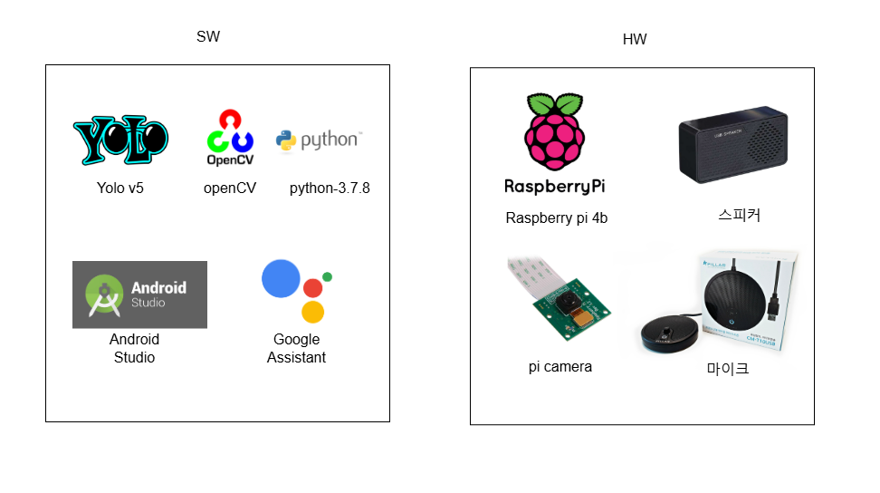

# CSE

## 프로젝트 개요
- **주제**: 활동 감지 스마트 홈
- **팀명**: CSE
- **지도 교수**: 조용호 교수님
- **팀원**: 김예찬, 원준혁, 장성민, 최진호

## 목차
1. 팀원별 역할
2. 개발 일정
3. 목적 계통도
4. 기능 블록도 및 작품 요약
5. 설계 제한 요소
6. 소프트웨어 및 하드웨어
7. 알고리즘 설명 및 상세 설명
8. 제작 과정
9. 소스 코드
10. 자체 평가 및 소감감
11. 회의록
12. 참고자료

---

### 1. 팀원별 역할

- **김예찬**: 음성 인식 작업, 라즈베리파이 서버 관리
- **원준혁**: 프로젝트 총괄, 인터페이스 구현
- **장성민**: 자료 조사, 객체 인식 프로그램 작성
- **최진호**: 자료 조사 보조, 이메일 자동 전송 코드 작성
  
---
### 2. 개발 일정

개발 일정은 프로젝트 진행에 따라 다르게 진행되었습니다. (상세 내용 생략)

---
### 3. 목적 계통도

목적 계통도를 통해 프로젝트의 주요 기능과 흐름을 정의했습니다.

---
### 4. 기능 블록도 및 작품 요약

- 라즈베리파이 카메라를 통해 사람 인식
- 30초 이상 움직임이 없을 경우 이메일 알림 전송
- 음성 인식을 통해 특정 명령 실행
- 어플리케이션과 라즈베리파이의 실시간 데이터 통신  

---
### 5. 설계 제한 요소
- **안전성**: 구조물의 안전성 확보
- **신뢰성**: 어플리케이션과 통신의 안정성 보장
- **사회적 영향**: 독거노인을 위한 사회적 대처

---
### 6. 사용된 소프트웨어 및 하드웨어
- **소프트웨어**:
  - YOLO V8nano: 객체 인식
  - OpenCV: 객체 인식 보조
  - Android Studio: 어플리케이션 개발
  - Google Assistant: 음성 인식
- **하드웨어**:
  - RaspberryPi, 스피커, 카메라, 마이크

---
### 7. 알고리즘 설명 및 상세 설명

- YOLO를 통한 객체 인식 후 위치 정보를 분석하여 30초 이상 비정상적 움직임이 없을 경우 알림을 전송
- 마이크를 통해 음성 데이터를 실시간으로 받아 Google Assistant를 통해 처리
- 특정 음성 인식 시 경고 메시지를 이메일로 전송

---
### 8. 제작 과정

1. Raspberry Pi에 64비트 OS 설치
   

2. OpenCV 설치 및 YOLO 모델 사용

  

3. TCP/IP를 이용한 서버 구축 및 소켓 통신 구현

4. Android Studio를 이용해 클라이언트 어플리케이션 개발

---
### 9. 현재까지 개발된 소스 코드
- **YOLO 객체 인식 코드**: 라즈베리파이에서 YOLO 모델을 사용하여 사람을 인식하고 비정상적 움직임 시 알림 전송
- **TCP/IP 서버 코드**: 클라이언트와 실시간 통신을 위한 서버 구현
- **자동 이메일 전송 코드**: 위험 상황 발생 시 이메일로 경고 전송
- **Android 클라이언트 코드**: 어플리케이션에서 서버와 통신하여 실시간 데이터 수신

---
### 10. 자체 평가 및 소감
원준혁

- 독거노인을 위한 시스템을 개발하기로 결정되었을 때 좋은 취지의 주제인 것 같기도 하고 첫
캡스톤 디자인이라 꼭 완성도 높은 작품물을 만들어 내고 싶었다 하지만 . 첫 캡스톤 디자인이
라 서툴러서 시간에 쫓겨 제작한 것이 아쉽다 특히 . 어플리케이션 구현 부분에서 원래 라즈베
리파이 카메라의 화면을 실시간 스트리밍 받아 볼 수 있게 하려 했는데 계속되는 실패로 이미
지 파일로 바꾼 것이 가장 아쉽다 심지어 . 이미지 파일조차 화면에 출력하는 것이 쉽지 않았
다 또한 . 라즈베리파이와 어플리케이션 간의 통신이 생각보다 쉽게 될 줄 알아서 후 순위로
밀려났었는데 실제로 해보니 두 기기 간의 통신이 가장 어려웠어서 크게 당황했다 통신 . 방법
을 이것저것 시도해 보다 보니 시간에 쫓겨서 결과물이 만족스럽게 나오지 못한 것 같다 하.
지만 안드로이드 스튜디오의 사용법의 기초이상 정도는 숙지 한 것 같아서 공부가 많이 된 캡
스톤 디자인이 된 것 같다 다시 . 비슷한 주제로 프로젝트를 하게 된다면 더욱더 빠르고 완성
도를 높게 만들 수 있을 것 같다.

최진호

- 캡스톤 디자인하면서 앱을 처음 만들어 봤는데 쉽게 쉽게 만들어 질줄 알았지만 앱과 라즈베
리파이를 연동하는 거에서부터 오류가 나고 실시간 스트리밍을 통해 어플리케이션에서 카메라
를 보는 코드를 짜는데 계속되는 시도에도 결국 실패로 마무리되어 너무 아쉬웠다 내년 . 캡스
톤 디자인 때에 앱을 만들 기회가 생긴다면 다시 도전해 성공해 보고 싶다.

김예찬

- 눈으로 보기엔 쉬워 보이고 ‘나 정도면 만들 수 있겠지 라고 ’ 생각한 것들이 막상 해보니 안되
는 경우가 많았습니다 추가 . 구현하고 싶은 것도 많고 더, 완벽하게 만들 수 있는 부분이 있
었지만 전문지식의 , 한계와 배우지 않았던 새로운 것들에 첫 만남이 많은 부족함으로 보여줬
다고 생각합니다 특히 . 모바일과 라즈베리파이의 소켓 통신을 하려는 부분에서 직접 통신 코
드를 짜려고 하니 많은 문제점들이 있었습니다 처음 . 계획한 의도대로만 만들어진다면 주변인
들에게 선물로 주고 싶고 지금 , 당장은 많이 부족하지만 시간을 좀 더 투자하고 이 분야에 좀
더 공부를 한다면 보급형으로 싸고 간편하게 사용할 수 있다고 생각합니다.
시간을 투자한 시간 대비 결과물이 썩 좋게 나오지 못 한게 아쉽게 느껴지는 프로젝트였습니
다 생각했던 . 것보다 각 라이브러리별 파이썬 버전 호환이 가장 큰 문제점 이였으며 더, 좋은
결과물을 만들지 못한 원인이기도 합니다 하지만 . 아무것도 모르는 채 머리 박으면서 했던 이
프로젝트에 결과로만 따지면 버린 시간이 많지만 개인의 , 입장에서는 리눅스 OS인 라즈베리
파이 4 를 가지고 각종 라이브러리를 깔아보고 가상환경 각종 , , 어플 코드 뜯어보고 설 , API
정 및 GPT, GoogleAssistant , TCP/IP 설치 통신 등 많은 것을 배울 수 있었던 시간들이었습
니다 이. 프로젝트가 끝나더라도 라즈베리파이로 좀 더 해보고싶은 것이 많고 이번 , 프로젝트
에 부족한 부분을 채워 소프트웨어 쪽으로 조금 더 관심을 갖게 된 계기가 되었습니다.

장성민

- 캡스톤 디자인을 하면서 주제선정부터 시연까지 많은 일이 있었고 이, 를 통해 새로운 것을
개발해나가는 과정이 얼마나 힘든지 체험하는 계기가 되었다 특히 . 라즈베리파이에서 yolo를
통한 객체인식의 프로그램을 만드는 과정에서 많이 느꼈다 단순히 . 라이브러리를 사용하여 프
로그램을 짜면 끝이 아니라 “원하는 동작을 하기위해서 최소한 몇 프레임이 나와야 하는 가”
에 대해 생각하면서 여러 가지 모델을 가져와서 사용해 봐도 프레임이 개선되어야 하지만 정
작 개선되지 않는 경우가 많아 개발이라는 일의 어려움을 느끼게 된 것 같다

---
### 11. 회의록
- **9월 14일**: 라즈베리파이를 사용하여 작품을 만들기로 결정
- **9월 15일**: 스마트창문 제작 결정
- **9월 21일**: 스마트창문 아이디어 폐기, 박수 소리를 이용한 홈 제어 시스템으로 전환
- **9월 26일**: 박수 소리 인식 방법에 대한 의견 공유
- **10월 10일**: 필요 물품 조사 및 구매
- **10월 25일**: 어플리케이션과 라즈베리파이 통신 방법 논의
- **11월 15일**: 박수 소리 아이디어 폐기, 독거노인 위급 상황 대응 시스템 제작 결정
- **11월 27일**: 어플리케이션과 라즈베리파이 통신 방법 모색 (HTTP 및 TCP/IP 프로토콜 사용 결정)
- **12월 5일**: 필요 물품 조사 및 구매
- **12월 10일**: 어플리케이션과 라즈베리파이 통신 실패로 인해 방법 모색 및 구현 시도

---
### 참고자료
- [실시간 추론 - PYTORCH](https://tutorials.pytorch.kr/intermediate/realtime_rpi.html)
- [라즈베리파이 YOLO 사용](https://docs.ultralytics.com/guides/raspberry-pi/#initiate-tcp-stream-with-libcamera_1)
- [안드로이드 블루투스 참고](https://developer.android.com/guide/topics/connectivity/bluetooth?hl=ko)

---
